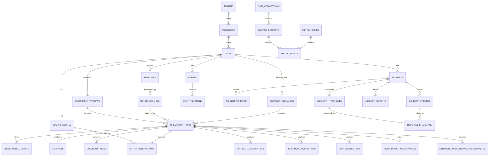

# DATA_MODEL.md
## Publisher Incident Intelligence — Data Model Specification
### v1.0 — Codex Implementation Contract

**Audience:** Codex, backend engineering, technical reviewers  
**Status:** MVP schema contract  
**Primary database:** PostgreSQL  
**Object storage:** S3-compatible storage for large artifacts  
**Depends on:** `DOMAIN.md`, `BROWSER.md`, `PRODUCT.md`, `MVP.md`  
**Feeds:** `EVENTS.md`, `CONNECTORS.md`, `INCIDENT.md`, `EVALS.md`

---

# 0. Purpose

This document defines how the platform represents and persists the world it observes.

The data model must support the product's core question:

> **When a publisher reports a problem, can we reconstruct what the system looked like before, what changed, what metrics moved, what external events occurred, and what evidence supports or contradicts each hypothesis?**

The schema is therefore optimized for:
- longitudinal operational memory;
- immutable evidence;
- reproducible derived data;
- incident reconstruction;
- segmentation;
- causal investigation;
- human-readable timelines;
- simple PostgreSQL operation at MVP scale.

It is **not** optimized for:
- advertising billing;
- a generic data warehouse;
- a full event-stream platform;
- user-level analytics;
- real-time bidding storage;
- session replay;
- a graph database.

---

# 1. Core modeling principle

The platform MUST distinguish these concepts:

```text
ENTITY
STATE / OBSERVATION
METRIC
EVENT
ANOMALY
INCIDENT
HYPOTHESIS
EVIDENCE
CONCLUSION
```

They are related, but they are not interchangeable.

Example:

```text
ENTITY
GPT slot article_mid_2

STATE
slot exists in checkpoint at 12:00

METRIC
mobile GAM requests = 1.42M

EVENT
article_mid_2_removed

ANOMALY
mobile requests/view below baseline

INCIDENT
"Mobile monetization worsened from Aug 10"

HYPOTHESIS
"Article template deployment removed monetizable inventory"

EVIDENCE
slot disappeared before request/view declined

CONCLUSION
PROBABLE
```

Codex MUST NOT collapse these into one generic `events` table.

---

# 2. System of record vs derived data

The platform follows a strict distinction.

## Systems of record

Raw or authoritative observations:

- browser checkpoint manifests;
- screenshots;
- raw/normalized browser artifacts;
- GA4 extracts;
- Search Console extracts;
- GAM extracts;
- external platform event records;
- manual operational notes/changes;
- user incident input.

These records answer:

> **What did we observe or receive?**

## Derived data

Computed from systems of record:

- normalized entity observations;
- semantic diffs;
- events;
- anomalies;
- Last Known Good;
- event relations;
- hypotheses;
- evidence relationships;
- incident findings;
- weekly summaries.

These answer:

> **What does the evidence appear to mean?**

Derived data SHOULD be reproducible from source evidence where practical.

---

# 3. Append-oriented history

Historical evidence MUST be append-oriented.

If a script existed at 12:00 and disappeared at 18:00:

Do not update the old row from:

```text
active = true
```

to:

```text
active = false
```

and lose history.

Instead preserve:

```text
12:00 observation → present
18:00 observation → absent / not observed
```

and derive:

```text
script_removed
```

Likewise:
- old checkpoints are immutable;
- source extracts are immutable;
- events are historical facts/findings;
- new reasoning versions do not silently rewrite old evidence.

---

# 4. PostgreSQL stance

Use PostgreSQL as the primary structured store.

Current PostgreSQL supports:
- native `uuid`;
- relational constraints;
- JSON/JSONB;
- B-tree and partial indexes;
- declarative partitioning when needed.

For MVP:

**Do not partition tables by default.**

Design large fact tables so partitioning can be added later if actual volume requires it.

Do not add:
- ClickHouse;
- TimescaleDB;
- Neo4j;
- Kafka;
because the data model looks "observability-like."

The first few publishers do not justify that complexity.

---

# 5. Object storage boundary

Large binary or forensic artifacts MUST live outside PostgreSQL.

Examples:
- screenshots;
- raw DOM/HTML;
- Playwright trace;
- large network trace;
- exported raw connector result;
- compressed diagnostic bundle.

PostgreSQL stores:

```text
artifact metadata
object key / storage URI
content type
byte size
hash
retention class
encryption/access metadata
```

Do not store large screenshots or DOM blobs directly in table columns.

---

# 6. Identifier policy

Primary keys SHOULD use PostgreSQL's native `uuid` type.

Preferred:
- application-generated UUIDv7 if the chosen application library is mature and deployment-safe;
- otherwise UUIDv4.

Do not make PostgreSQL 18's built-in UUIDv7 support a deployment requirement for MVP.

Rationale:
- UUID avoids cross-service/key-space collisions;
- UUIDv7 can improve locality and sortability;
- compatibility matters more than theoretical perfection.

External/native platform IDs remain separate columns.

Examples:
- GAM line item ID;
- GPT ad-unit path;
- GA4 property ID;
- Search Console property;
- bidder code.

Never replace native IDs with our UUID.

---

# 7. Time policy

All event/observation timestamps stored in PostgreSQL MUST use:

```text
timestamptz
```

Application and DB canonical time:
**UTC**.

Preserve source-time context separately where needed:

```text
source_timezone
source_local_date
reporting_timezone
```

Do not store publisher-local wall-clock time as the only timestamp.

---

# 8. Soft archival vs deletion

Configuration entities should normally use:

```text
archived_at
```

instead of hard deletion if historical evidence references them.

Examples:
- monitored URL removed;
- scenario retired;
- template deprecated;
- connection disconnected.

Raw evidence MUST NOT be cascaded away because configuration was archived.

---

# 9. Tenant isolation

The product is multi-tenant even if the pilot begins with one publisher.

Use:

```text
tenant
    ↓
publisher
    ↓
site
```

`tenant_id` SHOULD be present directly on high-volume tenant-owned fact tables even when it is derivable through `site_id`.

Why:
- easier security/RLS later;
- simpler tenant filtering;
- safer indexes;
- less chance of accidental cross-tenant queries.

This is intentional denormalization for isolation.

---

# 10. Top-level hierarchy

```text
Tenant
 └── Publisher
      └── Site
           ├── Template
           │    └── Monitored URL
           ├── Browser Scenario
           ├── Connector
           ├── Checkpoint Window
           ├── Metrics
           ├── Events
           └── Incidents
```

A tenant may eventually own multiple publishers.

A publisher may own multiple sites/domains.

Do not assume:

```text
tenant == publisher == domain
```

even if the first pilot happens to fit that model.

---

# 11. Tenant

Table:

```text
tenants
```

Purpose:
security/billing/ownership boundary.

Suggested fields:

```yaml
id: uuid PK
name: text
slug: text unique
status: text
created_at: timestamptz
archived_at: timestamptz nullable
settings: jsonb
```

Do not put publisher operational state inside `settings`.

Use JSONB only for low-risk tenant configuration that does not deserve a first-class schema field yet.

---

# 12. Publisher

Table:

```text
publishers
```

Represents the business/editorial publisher, not merely a domain.

Fields:

```yaml
id: uuid PK
tenant_id: uuid FK tenants
name: text
slug: text
default_timezone: text
default_currency: text nullable
status: text
created_at: timestamptz
archived_at: timestamptz nullable
metadata: jsonb
```

Unique recommendation:

```text
UNIQUE (tenant_id, slug)
```

---

# 13. Site

Table:

```text
sites
```

Represents one monitored web property.

Fields:

```yaml
id: uuid PK
tenant_id: uuid FK tenants
publisher_id: uuid FK publishers
name: text
canonical_domain: text
canonical_scheme: text
default_locale: text nullable
timezone: text
status: text
onboarded_at: timestamptz nullable
created_at: timestamptz
archived_at: timestamptz nullable
metadata: jsonb
```

Potential unique constraint:

```text
UNIQUE (tenant_id, canonical_domain)
```

Do not assume one hostname only.

A later `site_hosts` table can represent:
- www;
- m;
- AMP;
- subdomains;
if pilots need it.

Do not build it before necessary.

---

# 14. Template

Table:

```text
templates
```

A stable logical page type.

Examples:
- homepage;
- category;
- article;
- video_article;
- gallery.

Fields:

```yaml
id: uuid PK
tenant_id: uuid
site_id: uuid
code: text
display_name: text
template_family: text
status: text
fingerprint_version: text nullable
expected_features: jsonb
created_at: timestamptz
archived_at: timestamptz nullable
```

Recommended unique:

```text
UNIQUE (site_id, code)
```

`expected_features` may contain low-volatility hints such as:

```json
{
  "gpt": true,
  "cmp": true,
  "video": false,
  "prebid": "optional"
}
```

Do not store current slot inventory only in this JSON.

Expected slot entities deserve first-class records.

---

# 15. Monitored URL

Table:

```text
monitored_urls
```

Represents a concrete URL currently used to observe a template.

Fields:

```yaml
id: uuid PK
tenant_id: uuid
site_id: uuid
template_id: uuid FK templates
url: text
priority: integer
is_canary: boolean
status: text
interaction_profile_id: uuid nullable
valid_from: timestamptz
valid_to: timestamptz nullable
created_at: timestamptz
archived_at: timestamptz nullable
metadata: jsonb
```

A concrete article URL may rotate while the template stays stable.

Do not overwrite the URL history.

When a representative URL changes:
- archive/close old validity;
- create new record.

---

# 16. Interaction profile

Table:

```text
interaction_profiles
```

Defines deterministic browser actions.

Fields:

```yaml
id: uuid PK
tenant_id: uuid
site_id: uuid nullable
code: text
version: integer
description: text
steps: jsonb
created_at: timestamptz
retired_at: timestamptz nullable
```

Example `steps`:

```json
[
  {"type":"wait","profile":"initial"},
  {"type":"consent","action":"primary"},
  {"type":"scroll","percent":25},
  {"type":"wait","profile":"short"},
  {"type":"scroll","percent":50},
  {"type":"scroll","percent":75},
  {"type":"inspect","target":"sticky_and_video"}
]
```

This is an appropriate use of JSONB because interaction steps are ordered configuration, not query-critical business facts.

---

# 17. Browser scenario

Table:

```text
browser_scenarios
```

Defines environment identity.

Fields:

```yaml
id: uuid PK
tenant_id: uuid nullable
site_id: uuid nullable
code: text
version: integer
device_class: text
device_profile: jsonb
locale: text
timezone: text
geo_profile: jsonb nullable
consent_path: text
cache_mode: text
network_profile: text
interaction_profile_id: uuid nullable
status: text
created_at: timestamptz
retired_at: timestamptz nullable
```

Examples:

```text
core_desktop_v1
core_mobile_v1
consent_reject_mobile_v1
```

Scenario definition MUST be versioned.

Never silently mutate `core_mobile_v1` into a different viewport/user agent.

Create `core_mobile_v2`.

---

# 18. Checkpoint terminology

The word “checkpoint” can become ambiguous.

Use two explicit database concepts:

## CHECKPOINT WINDOW

A scheduled six-hour monitoring window for a site.

Example:

```text
2026-08-13 00:00 UTC window
```

## CHECKPOINT RUN

One actual:

```text
monitored URL × browser scenario
```

execution within that window.

This prevents pretending that 40 pages were captured atomically at exactly the same millisecond.

---

# 19. Checkpoint window

Table:

```text
checkpoint_windows
```

Fields:

```yaml
id: uuid PK
tenant_id: uuid
site_id: uuid
scheduled_for: timestamptz
window_start: timestamptz
window_end: timestamptz
status: text
created_at: timestamptz
completed_at: timestamptz nullable
```

Possible status:

```text
SCHEDULED
RUNNING
COMPLETE
PARTIAL
FAILED
```

Unique recommendation:

```text
UNIQUE (site_id, scheduled_for)
```

The status summarizes child runs.

It is not evidence that the publisher site was healthy.

---

# 20. Checkpoint run

Table:

```text
checkpoint_runs
```

This is one of the most important system-of-record tables.

Fields:

```yaml
id: uuid PK
tenant_id: uuid
site_id: uuid
checkpoint_window_id: uuid FK checkpoint_windows
monitored_url_id: uuid FK monitored_urls
template_id: uuid FK templates
scenario_id: uuid FK browser_scenarios
scheduled_for: timestamptz
started_at: timestamptz
completed_at: timestamptz nullable
status: text
attempt_count: integer
final_url: text nullable
http_status: integer nullable
playwright_version: text
chromium_version: text
collector_bundle_version: text
environment: jsonb
limitations: jsonb
created_at: timestamptz
```

Status:

```text
COMPLETE
PARTIAL
SITE_ERROR
BROWSER_ERROR
TIMEOUT
BLOCKED
```

This row is immutable after finalization except for strictly operational fields such as retention bookkeeping.

---

# 21. Browser attempt

Retries must not erase evidence.

Table:

```text
checkpoint_attempts
```

Fields:

```yaml
id: uuid PK
tenant_id: uuid
checkpoint_run_id: uuid FK checkpoint_runs
attempt_number: integer
started_at: timestamptz
completed_at: timestamptz nullable
status: text
failure_class: text nullable
failure_message: text nullable
metadata: jsonb
```

Unique:

```text
UNIQUE (checkpoint_run_id, attempt_number)
```

If attempt 1 sees a site 503 and attempt 2 is healthy:
both attempts remain.

Do not store only the successful retry.

---

# 22. Artifact

Table:

```text
artifacts
```

Represents a stored object.

Fields:

```yaml
id: uuid PK
tenant_id: uuid
site_id: uuid
checkpoint_run_id: uuid nullable
source_extract_id: uuid nullable
incident_id: uuid nullable
artifact_type: text
storage_provider: text
object_key: text
content_type: text
byte_size: bigint
sha256: text
compression: text nullable
retention_class: text
created_at: timestamptz
expires_at: timestamptz nullable
metadata: jsonb
```

Examples `artifact_type`:

```text
SCREENSHOT_VIEWPORT_PRECONSENT
SCREENSHOT_VIEWPORT_POSTCONSENT
SCREENSHOT_FULL_PAGE
RAW_DOM
NORMALIZED_DOM
PLAYWRIGHT_TRACE
NETWORK_TRACE
RAW_CONNECTOR_RESPONSE
INCIDENT_EXPORT
```

Rule:
an artifact row references a binary/large object; it is not the object itself.

---

# 23. Artifact integrity

Store a content hash, preferably SHA-256.

Purpose:
- detect corruption;
- avoid ambiguous duplicates;
- provide forensic integrity;
- optionally deduplicate identical artifacts later.

Do not build global content-addressable storage in MVP.

Hash first; optimize later.

---

# 24. Collector execution

A checkpoint contains several independent collectors.

Table:

```text
collector_runs
```

Fields:

```yaml
id: uuid PK
tenant_id: uuid
checkpoint_run_id: uuid
collector_type: text
collector_version: text
status: text
started_at: timestamptz
completed_at: timestamptz nullable
error_code: text nullable
error_message: text nullable
summary: jsonb
```

Status:

```text
OK
NOT_PRESENT
NOT_OBSERVABLE
ERROR
TIMEOUT
```

This distinction is mandatory.

`NOT_PRESENT`:
Prebid genuinely not detected.

`NOT_OBSERVABLE`:
server-side behavior exists but detail is hidden.

Those are different facts.

---

# 25. Domain entity registry

The product observes many stable entities:
- scripts;
- network dependencies;
- GPT slots;
- bidders;
- players;
- CMP;
- GAM ad units;
- line items;
- pricing rules.

We need stable identity across observations.

Use:

```text
domain_entities
```

Fields:

```yaml
id: uuid PK
tenant_id: uuid
site_id: uuid
entity_kind: text
stable_key: text
display_name: text nullable
source_system: text nullable
native_id: text nullable
first_seen_at: timestamptz
last_seen_at: timestamptz nullable
archived_at: timestamptz nullable
identity_metadata: jsonb
created_at: timestamptz
```

Recommended unique:

```text
UNIQUE (site_id, entity_kind, stable_key)
```

---

# 26. Why a domain entity registry exists

Different systems may describe the same apparent thing differently.

Examples:

```text
DOM slot container
GPT slot
GAM ad unit
Prebid adUnit
```

They MAY represent one monetization position.

But do not merge them merely because their names look similar.

The entity registry provides identity.

Relationships provide mapping.

---

# 27. Entity relationship

Table:

```text
entity_relations
```

Fields:

```yaml
id: uuid PK
tenant_id: uuid
site_id: uuid
from_entity_id: uuid FK domain_entities
to_entity_id: uuid FK domain_entities
relation_type: text
confidence: text
source: text
valid_from: timestamptz
valid_to: timestamptz nullable
metadata: jsonb
created_at: timestamptz
```

Examples:

```text
DOM_CONTAINER_REPRESENTS_GPT_SLOT
GPT_SLOT_MAPS_TO_GAM_AD_UNIT
PREBID_ADUNIT_FEEDS_GPT_SLOT
PLAYER_USES_AD_UNIT
SCRIPT_BELONGS_TO_VENDOR
```

Do not use `CAUSES` here.

This is entity topology, not incident causality.

---

# 28. Generic entity observation

Use:

```text
entity_observations
```

for stable entity state that does not justify a specialized table.

Fields:

```yaml
id: uuid PK
tenant_id: uuid
site_id: uuid
checkpoint_run_id: uuid
entity_id: uuid FK domain_entities
observation_type: text
observed_at: timestamptz
state_hash: text nullable
state: jsonb
collector_version: text
created_at: timestamptz
```

Appropriate for:
- script presence/version fingerprint;
- network dependency state;
- generic player fingerprint;
- fixed/sticky state;
- CMP brand fingerprint.

Not appropriate for every metric or incident.

---

# 29. JSONB policy

JSONB is allowed for:
- source-specific metadata;
- scenario definitions;
- ordered interaction steps;
- collector-specific state;
- dimension maps;
- evidence details.

JSONB MUST NOT replace core columns for:
- tenant/site IDs;
- timestamps;
- status;
- metric name/value;
- incident ID;
- hypothesis confidence;
- event type;
- relationship direction.

Rule:

> If we routinely filter, join, sort, constrain or explain a field, it probably deserves a column.

---

# 30. Script observation

Scripts may use the generic entity model.

Entity:

```text
entity_kind = SCRIPT_DEPENDENCY
stable_key = normalized host/path family or deterministic fingerprint
```

Observation state example:

```json
{
  "present": true,
  "src": "https://vendor.example/path/app.js",
  "async": true,
  "defer": false,
  "content_hash": null,
  "load_status": "OK",
  "load_ms": 84.3
}
```

Do not create a new entity because a cache-buster changed.

---

# 31. Network dependency observation

Entity:

```text
entity_kind = NETWORK_DEPENDENCY
```

Observation state:

```json
{
  "host": "bidder.example.com",
  "path_family": "/openrtb2",
  "category": "HEADER_BIDDING_SSP",
  "request_count": 8,
  "error_count": 1,
  "status_4xx": 0,
  "status_5xx": 1,
  "timeout_count": 0,
  "latency_ms_p50": 91.2,
  "latency_ms_p95": 181.9
}
```

Do not store every volatile request as a permanent domain entity.

Raw request-level detail may remain in a short-lived artifact.

---

# 32. JavaScript error fingerprint

Use a dedicated table because error recurrence and persistence are query-critical.

Table:

```text
js_error_observations
```

Fields:

```yaml
id: uuid PK
tenant_id: uuid
site_id: uuid
checkpoint_run_id: uuid
fingerprint: text
error_type: text nullable
normalized_message: text
source_host: text nullable
source_path: text nullable
top_frame: text nullable
count: integer
first_seen_in_run_at: timestamptz nullable
stack_sample: text nullable
collector_version: text
created_at: timestamptz
```

Index:

```text
(site_id, fingerprint, created_at)
```

Do not make full stack text part of the key.

---

# 33. GPT slot identity

A GPT slot should be a `domain_entity`.

```text
entity_kind = GPT_SLOT
```

Stable key should prefer:
- publisher/GPT ad-unit path;
- configured slot identity;
- stable DOM/container mapping.

Do not use transient creative ID as slot identity.

---

# 34. GPT slot observation

Because GPT lifecycle is critical, use a specialized table.

```text
gpt_slot_observations
```

Fields:

```yaml
id: uuid PK
tenant_id: uuid
site_id: uuid
checkpoint_run_id: uuid
slot_entity_id: uuid FK domain_entities
dom_element_id: text nullable
ad_unit_path: text nullable
sizes: jsonb
expected: boolean
present: boolean
defined_at_ms: double precision nullable
requested_at_ms: double precision nullable
response_at_ms: double precision nullable
render_ended_at_ms: double precision nullable
onload_at_ms: double precision nullable
viewable_at_ms: double precision nullable
is_empty: boolean nullable
creative_id: text nullable
line_item_id: text nullable
request_count: integer
collector_version: text
created_at: timestamptz
```

Times are relative to navigation/run start.

Do not convert absent lifecycle stages into zero.

Use NULL for not observed.

---

# 35. Expected slot model

An expected slot cannot be inferred only from the current page.

Use:

```text
template_expected_entities
```

Fields:

```yaml
id: uuid PK
tenant_id: uuid
site_id: uuid
template_id: uuid
entity_id: uuid
expectation_type: text
valid_from: timestamptz
valid_to: timestamptz nullable
source: text
confidence: text
created_at: timestamptz
```

Example:

```text
template article_mobile
expects GPT_SLOT article_mid_2
```

This allows the system to detect:

```text
expected = true
present = false
```

rather than simply failing to observe the slot.

---

# 36. Prebid auction observation

Use a dedicated lightweight table for auction-level timing.

```text
prebid_auction_observations
```

Fields:

```yaml
id: uuid PK
tenant_id: uuid
site_id: uuid
checkpoint_run_id: uuid
auction_key: text
started_at_ms: double precision nullable
ended_at_ms: double precision nullable
configured_timeout_ms: integer nullable
ad_unit_count: integer nullable
bidder_request_count: integer
bid_response_count: integer
no_bid_count: integer
timeout_count: integer
collector_version: text
created_at: timestamptz
metadata: jsonb
```

`auction_key` is a normalized local run identity, not a durable cross-checkpoint entity.

Do not retain volatile auction IDs as long-term domain identities.

---

# 37. Prebid bidder observation

Table:

```text
prebid_bidder_observations
```

Fields:

```yaml
id: uuid PK
tenant_id: uuid
site_id: uuid
checkpoint_run_id: uuid
auction_observation_id: uuid
bidder_entity_id: uuid nullable
bidder_code: text
request_count: integer
response_count: integer
no_bid_count: integer
timeout_count: integer
response_time_ms_min: double precision nullable
response_time_ms_max: double precision nullable
response_time_ms_avg: double precision nullable
winning_bid_count: integer
collector_version: text
created_at: timestamptz
metadata: jsonb
```

Do not store every price/bid detail forever unless a pilot proves it necessary.

The product is incident intelligence, not an RTB data warehouse.

---

# 38. CMP observation

Use one checkpoint-level structured observation.

```text
cmp_observations
```

Fields:

```yaml
id: uuid PK
tenant_id: uuid
site_id: uuid
checkpoint_run_id: uuid
cmp_entity_id: uuid nullable
cmp_detected: boolean
tcf_api_detected: boolean
ui_detected_at_ms: double precision nullable
api_ready_at_ms: double precision nullable
consent_action: text
consent_action_status: text
action_completed_at_ms: double precision nullable
tc_state_available_at_ms: double precision nullable
gdpr_applies: boolean nullable
tc_string_hash: text nullable
tcf_error_codes: jsonb
collector_version: text
created_at: timestamptz
metadata: jsonb
```

Privacy rule:
do not assume the raw TC String must be stored indefinitely.

A hash/decoded safe subset may be sufficient.

`SECURITY.md` decides final retention.

---

# 39. Consent phase network summary

If we need pre-vs-post consent comparison, use:

```text
consent_phase_dependency_observations
```

Fields:

```yaml
id: uuid PK
tenant_id: uuid
checkpoint_run_id: uuid
phase: text
dependency_entity_id: uuid
request_count: integer
error_count: integer
first_request_at_ms: double precision nullable
created_at: timestamptz
```

Phase:

```text
PRE_CONSENT
POST_ACCEPT
POST_REJECT
```

Do not duplicate the entire raw network log here.

Store the diagnostic summary.

---

# 40. Video/player observation

A player is a `domain_entity`.

Use:

```text
video_player_observations
```

Fields:

```yaml
id: uuid PK
tenant_id: uuid
site_id: uuid
checkpoint_run_id: uuid
player_entity_id: uuid
present: boolean
visible: boolean nullable
sticky: boolean nullable
fixed: boolean nullable
autoplay: boolean nullable
muted: boolean nullable
controls_present: boolean nullable
dismiss_control_present: boolean nullable
width_px: double precision nullable
height_px: double precision nullable
vast_request_count: integer
vast_error_count: integer
media_request_count: integer
playback_started: boolean nullable
collector_version: text
created_at: timestamptz
metadata: jsonb
```

Do not infer Google policy compliance from this row.

It is observable behavior only.

---

# 41. SEO observation

Use a dedicated table because SEO state is compact and highly queryable.

```text
seo_observations
```

Fields:

```yaml
id: uuid PK
tenant_id: uuid
site_id: uuid
checkpoint_run_id: uuid
final_url: text
http_status: integer nullable
title_hash: text nullable
meta_robots: text nullable
canonical_url: text nullable
important_content_present: boolean nullable
redirect_count: integer
mobile_render_ok: boolean nullable
collector_version: text
created_at: timestamptz
metadata: jsonb
```

robots.txt/sitemap are site-level public config, not necessarily page-level.

Model them separately.

---

# 42. Public site configuration snapshot

Use:

```text
public_config_snapshots
```

for:
- robots.txt;
- ads.txt;
- sitemap index if monitored;
- other small public configuration artifacts.

Fields:

```yaml
id: uuid PK
tenant_id: uuid
site_id: uuid
config_type: text
observed_at: timestamptz
http_status: integer nullable
content_hash: text nullable
parse_status: text
artifact_id: uuid nullable
normalizer_version: text
summary: jsonb
created_at: timestamptz
```

Examples `config_type`:

```text
ROBOTS_TXT
ADS_TXT
SITEMAP_INDEX
```

Do not create an event directly here.

`EVENTS.md` compares snapshots and decides significance.

---

# 43. ads.txt normalized record

For semantic diffing use:

```text
ads_txt_records
```

Fields:

```yaml
id: uuid PK
tenant_id: uuid
site_id: uuid
snapshot_id: uuid FK public_config_snapshots
advertising_system_domain: text
publisher_account_id: text
relationship: text
cert_authority_id: text nullable
record_hash: text
is_valid: boolean
validation_errors: jsonb
created_at: timestamptz
```

Do not store one mutable "current ads.txt table."

Records belong to a snapshot.

Current state is a derived view.

---

# 44. Synthetic performance observation

Use one table:

```text
synthetic_performance_observations
```

Fields:

```yaml
id: uuid PK
tenant_id: uuid
site_id: uuid
checkpoint_run_id: uuid
lcp_ms: double precision nullable
cls: double precision nullable
inp_ms: double precision nullable
inp_method: text nullable
ttfb_ms: double precision nullable
dom_content_loaded_ms: double precision nullable
load_event_ms: double precision nullable
long_task_count: integer nullable
long_task_total_ms: double precision nullable
collector_version: text
created_at: timestamptz
metadata: jsonb
```

The source is always synthetic browser.

Never merge these values into field performance without explicit provenance.

---

# 45. Connector

The detailed connection protocol belongs to `CONNECTORS.md`.

The data model needs a connection record.

Table:

```text
data_connections
```

Fields:

```yaml
id: uuid PK
tenant_id: uuid
site_id: uuid nullable
provider: text
external_account_id: text nullable
external_property_id: text nullable
status: text
scopes: jsonb
secret_reference: text nullable
connected_at: timestamptz nullable
last_success_at: timestamptz nullable
last_error_at: timestamptz nullable
created_at: timestamptz
archived_at: timestamptz nullable
metadata: jsonb
```

Provider examples:

```text
GA4
GSC
GAM
```

Do not store plaintext OAuth tokens in this table.

`secret_reference` points to secure secret storage/encrypted token management defined in `SECURITY.md`.

---

# 46. Source extract

Every connector query produces a provenance record.

Table:

```text
source_extracts
```

Fields:

```yaml
id: uuid PK
tenant_id: uuid
site_id: uuid
connection_id: uuid
source: text
extract_type: text
query_definition: jsonb
period_start: timestamptz nullable
period_end: timestamptz nullable
source_timezone: text nullable
requested_at: timestamptz
retrieved_at: timestamptz nullable
status: text
freshness_status: text nullable
response_metadata: jsonb
raw_artifact_id: uuid nullable
connector_version: text
created_at: timestamptz
```

Examples:

```text
GA4_TRAFFIC
GSC_SEARCH
GSC_DISCOVER
GAM_INVENTORY_HEALTH
GAM_DEMAND_HEALTH
GAM_DIRECT_PROGRAMMATIC_COMPOSITION
```

This preserves what query actually generated the metric points.

---

# 47. Source extract immutability

If the same period is queried again tomorrow:

create another extract.

Why:
- source data may mature;
- reporting may be corrected;
- late data may arrive;
- connector definitions may change.

Do not overwrite the previous extract.

Downstream materialized views may choose the latest mature extract.

---

# 48. Metric series model

Metrics should use a two-table model:

```text
metric_series
metric_points
```

A series identifies:

> metric semantics + dimensions

A point identifies:

> value over a time bucket

This avoids repeating the same dimension map on every point.

---

# 49. Metric series

Table:

```text
metric_series
```

Fields:

```yaml
id: uuid PK
tenant_id: uuid
site_id: uuid
source: text
metric_code: text
metric_semantics_version: text
unit: text
granularity: text
dimensions: jsonb
entity_id: uuid nullable
created_at: timestamptz
archived_at: timestamptz nullable
```

Examples:

```text
source = GA4
metric_code = active_users
dimensions = {"device":"mobile","channel":"Organic Search"}

source = GAM
metric_code = ad_requests
dimensions = {"device":"mobile","programmatic_channel":"Ad Exchange"}
```

Recommended fingerprint/unique strategy:
derive a stable canonical hash over:

```text
site + source + metric_code + semantics_version + granularity + dimensions + entity
```

Store that as:

```text
series_key
```

with unique constraint.

---

# 50. Metric point

Table:

```text
metric_points
```

Fields:

```yaml
id: uuid PK
tenant_id: uuid
site_id: uuid
series_id: uuid FK metric_series
source_extract_id: uuid nullable
period_start: timestamptz
period_end: timestamptz
value: double precision
numerator: double precision nullable
denominator: double precision nullable
sample_status: text nullable
freshness_status: text nullable
retrieved_at: timestamptz
created_at: timestamptz
```

Unique should include provenance/versioning carefully.

Do not make:

```text
UNIQUE(series_id, period_start)
```

if multiple source extracts for the same period must coexist.

Possible unique:

```text
UNIQUE(series_id, period_start, source_extract_id)
```

Derived "best current point" is a view/query, not destructive overwrite.

---

# 51. Why double precision for telemetry

The product is not an accounting ledger.

GA4/GSC/GAM observations are diagnostic telemetry.

`double precision` is acceptable for:
- counts within normal web scale;
- percentages;
- ratios;
- eCPM;
- diagnostic revenue values.

If exact monetary accounting becomes a requirement:
introduce a dedicated financial representation.

Do not turn the MVP metric store into an accounting system.

Raw source extract remains available for audit.

---

# 52. Rate denominator discipline

Whenever source data makes it possible, store:

```text
value
numerator
denominator
```

Example:

```text
fill_rate = 0.53
filled = 530000
requests = 1000000
```

This supports diagnosis.

A rate alone is dangerous.

Do not derive denominator later if source semantics are ambiguous.

---

# 53. Metric semantics version

Metric meaning changes must be versioned.

Examples:
- GAM report definition changes;
- a denominator definition changes;
- category mapping changes;
- GA4 query definition changes.

Do not compare:

```text
metric_semantics_version = v1
```

and:

```text
v2
```

as if they were necessarily identical.

---

# 54. Dimension policy

Dimensions belong in canonical JSONB on `metric_series` because:
- GA4/GSC/GAM expose different dimension sets;
- MVP publisher count is small;
- schema churn is costly.

Rules:
- canonicalize key ordering;
- normalize known dimension names;
- do not place timestamps in dimensions;
- do not place high-volatility request IDs in dimensions;
- use stable platform/entity IDs where possible.

Potential common dimensions:

```text
device
country
channel
source_medium
template
category
page
ad_unit
format
demand_channel
yield_partner
line_item_type
search_type
```

---

# 55. Metric indexing

Start with:

```text
metric_points (tenant_id, site_id, period_start)
metric_points (series_id, period_start)
metric_series (site_id, source, metric_code)
```

Add GIN on `metric_series.dimensions` only after real queries prove it valuable.

Do not create dozens of speculative indexes.

---

# 56. Event definition registry

Use:

```text
event_definitions
```

to describe event semantics.

Fields:

```yaml
id: uuid PK
code: text unique
family: text
description: text
default_severity: text
schema_version: integer
active: boolean
metadata_schema: jsonb nullable
created_at: timestamptz
retired_at: timestamptz nullable
```

Examples:

```text
SITE_UNAVAILABLE
SCRIPT_DEPENDENCY_ADDED
JS_ERROR_STARTED
AD_SLOT_REMOVED
GAM_REQUEST_ANOMALY_STARTED
TCF_SIGNAL_MISSING
GOOGLE_CORE_UPDATE
MANUAL_CHANGE
ROLLBACK
```

The final taxonomy is defined in `EVENTS.md`.

---

# 57. Event instance

Table:

```text
events
```

Fields:

```yaml
id: uuid PK
tenant_id: uuid
site_id: uuid
event_definition_id: uuid
subject_entity_id: uuid nullable
template_id: uuid nullable
started_at: timestamptz
ended_at: timestamptz nullable
occurred_after_at: timestamptz nullable
occurred_before_at: timestamptz nullable
time_precision: text
detected_at: timestamptz
severity: text
observation_confidence: text
status: text
source_kind: text
source_version: text nullable
risk_score: double precision nullable
scope: jsonb
summary: text
details: jsonb
created_at: timestamptz
superseded_by_event_id: uuid nullable
```

Important:
`risk_score` is NOT causal confidence.

An event can be risky but irrelevant to a specific incident.

`observation_confidence` means confidence that the observed event/state change happened. It is not the confidence that the event caused an incident.

For checkpoint-derived changes, exact occurrence time may be unknown. Example: if a slot exists at 12:00 and is absent at 18:00, store the occurrence bounds:

```text
occurred_after_at = 12:00
occurred_before_at = 18:00
time_precision = WINDOW
```

Do not present 18:00 as the exact removal time merely because that is when the new state was first observed.

`scope` stores the evidence-supported affected segment (for example device/template/channel). Scope must never be broader than the observations support.

---

# 58. Event source evidence

Events should link to the observations from which they were derived.

Use:

```text
event_evidence_refs
```

Fields:

```yaml
id: uuid PK
tenant_id: uuid
event_id: uuid
evidence_kind: text
source_id: uuid
relation: text
summary: text nullable
created_at: timestamptz
```

`evidence_kind` examples:

```text
CHECKPOINT_RUN
ARTIFACT
ENTITY_OBSERVATION
GPT_SLOT_OBSERVATION
JS_ERROR_OBSERVATION
PUBLIC_CONFIG_SNAPSHOT
METRIC_POINT
SOURCE_EXTRACT
EXTERNAL_EVENT
MANUAL_CHANGE
```

This is an intentionally polymorphic application-level reference.

Why acceptable:
forcing 10 join tables creates significant MVP complexity.

Application code MUST validate the target reference before insert.

Do not use this pattern everywhere—only for cross-source evidence linking.

---

# 59. Anomaly

An anomaly is not the same as an event, but most surfaced anomalies may produce an event.

Use:

```text
anomalies
```

Fields:

```yaml
id: uuid PK
tenant_id: uuid
site_id: uuid
series_id: uuid nullable
subject_entity_id: uuid nullable
anomaly_type: text
started_at: timestamptz
ended_at: timestamptz nullable
detected_at: timestamptz
baseline_method: text
baseline_version: text
observed_value: double precision nullable
expected_value: double precision nullable
deviation: double precision nullable
persistence_buckets: integer
severity: text
status: text
details: jsonb
created_at: timestamptz
```

Example:

```text
mobile GAM requests/view below robust hour-of-week baseline
```

`EVENTS.md` decides when an anomaly becomes a timeline event.

---

# 60. External event

External events deserve a dedicated source-of-record table.

```text
external_events
```

Fields:

```yaml
id: uuid PK
source: text
external_event_type: text
product: text nullable
title: text
description: text nullable
started_at: timestamptz
ended_at: timestamptz nullable
announced_at: timestamptz nullable
status: text
scope: jsonb
source_url: text
source_native_id: text nullable
source_version: text nullable
evidence_tier: text
created_at: timestamptz
updated_at: timestamptz
```

Examples:
- Google Core Update;
- Google Search indexing incident;
- GAM outage;
- CDN outage;
- policy/standard change.

External events are global/reference facts.

Do not duplicate one row per publisher.

---

# 61. Site external-event relevance

The same external event may or may not matter to a publisher.

Use a derived relation:

```text
site_external_event_relations
```

Fields:

```yaml
id: uuid PK
tenant_id: uuid
site_id: uuid
external_event_id: uuid
relation: text
relevance: text
reason: text
derived_at: timestamptz
engine_version: text
created_at: timestamptz
```

Possible:

```text
CONTEXT
POSSIBLE_MATCH
LIKELY_RELEVANT
NOT_MATCHING_SEGMENT
```

Do not store:

```text
CAUSE
```

unless an incident later establishes strong publisher-specific evidence.

---

# 62. Operational change

Manual/deployment information is evidence distinct from browser-detected change.

Use:

```text
operational_changes
```

Fields:

```yaml
id: uuid PK
tenant_id: uuid
site_id: uuid
change_type: text
title: text
description: text nullable
occurred_at: timestamptz
actor_name: text nullable
actor_id: uuid nullable
approved_by_name: text nullable
external_reference: text nullable
expected_scope: jsonb
source: text
created_at: timestamptz
updated_at: timestamptz
```

Examples:
- deployment;
- GAM configuration change;
- CMP release;
- player release;
- manual rollback.

Browser observations may confirm or contradict the claimed scope.

---

# 63. Change vs event

A human-recorded deployment is an `operational_change`.

A browser-detected slot disappearance is an `event`.

They can be related.

Do not merge them into a single row.

Example:

```text
operational_change: article template deploy
        ↓
event: two GPT slots disappeared
        ↓
anomaly: requests/view fell
```

---

# 64. Event relations

Use:

```text
event_relations
```

Fields:

```yaml
id: uuid PK
tenant_id: uuid
site_id: uuid
from_event_id: uuid
to_event_id: uuid
relation_type: text
confidence: text nullable
reason: text nullable
derived_at: timestamptz
engine_version: text
created_at: timestamptz
```

Relation types from DOMAIN include:

```text
PRECEDES
COINCIDES_WITH
SAME_SEGMENT_AS
MECHANISTICALLY_CAN_AFFECT
METRIC_PARENT_OF
METRIC_DESCENDANT_OF
SUPPORTS
CONTRADICTS
INTRODUCED_BY
RESOLVED_AFTER
PERSISTED_AFTER_REMOVAL
EXTERNAL_CONTEXT_FOR
UNKNOWN_RELATION
```

Reserve `CAUSES` for confirmed relationships and introduce it only if `INCIDENT.md` defines strict criteria.

---

# 65. Event graph is relational

The event graph is a logical graph.

It lives in PostgreSQL as:
- events;
- event_relations.

Do not add Neo4j.

If graph traversal becomes a real performance bottleneck later, revisit.

MVP first.

---

# 66. Last Known Good

Last Known Good is derived.

Do not make one mutable boolean on checkpoints.

Use:

```text
last_known_good_refs
```

Fields:

```yaml
id: uuid PK
tenant_id: uuid
site_id: uuid
template_id: uuid nullable
scenario_id: uuid nullable
scope_key: text
checkpoint_run_id: uuid
valid_for_incident_id: uuid nullable
selected_at: timestamptz
selection_method: text
selection_version: text
reason: text
created_at: timestamptz
```

Why:
different incidents may have different relevant Last Known Good states.

Example:
Search incident may use a different reference than a mobile-video incident.

---

# 67. Incident

Table:

```text
incidents
```

Fields:

```yaml
id: uuid PK
tenant_id: uuid
publisher_id: uuid
site_id: uuid
title: text
symptom_family: text
description: text
reported_start_at: timestamptz nullable
reported_end_at: timestamptz nullable
opened_at: timestamptz
status: text
severity: text nullable
created_by: uuid nullable
resolved_at: timestamptz nullable
resolution_summary: text nullable
created_at: timestamptz
updated_at: timestamptz
```

Possible status:

```text
OPEN
INVESTIGATING
RESOLVED
CLOSED_UNRESOLVED
```

Do not force every incident to become RESOLVED_WITH_CAUSE.

---

# 68. Incident symptom

The initial user description should remain preserved.

Optional structured localization can be stored separately:

```text
incident_symptom_segments
```

Fields:

```yaml
id: uuid PK
incident_id: uuid
dimension: text
operator: text
value: text
source: text
created_at: timestamptz
```

Examples:

```text
device = mobile
traffic_source = Organic Search
template = video_article
```

Do not overwrite the user statement as the engine learns more.

---

# 69. Incident windows

Use:

```text
incident_windows
```

Fields:

```yaml
id: uuid PK
tenant_id: uuid
incident_id: uuid
window_type: text
starts_at: timestamptz
ends_at: timestamptz
selection_method: text
selection_version: text
rationale: text nullable
created_at: timestamptz
```

Types:

```text
BASELINE
PRE_INCIDENT
INCIDENT
RECOVERY
COMPARISON
```

Different symptom classes need different windows.

Do not hard-code one universal ±24h window.

---

# 70. Hypothesis

Table:

```text
incident_hypotheses
```

Fields:

```yaml
id: uuid PK
tenant_id: uuid
incident_id: uuid
rank: integer
failure_mode_code: text nullable
title: text
mechanism: text
confidence_label: text
status: text
internal_score: double precision nullable
score_components: jsonb
observability_limit: text nullable
created_by_engine_version: text
created_at: timestamptz
superseded_at: timestamptz nullable
```

Confidence labels:

```text
CONFIRMED
PROBABLE
POSSIBLE_CONTRIBUTOR
UNRESOLVED
```

`internal_score` may exist for ranking.

Never display it automatically as causal probability.

---

# 71. Hypothesis versioning

Investigation evolves.

Do not mutate a hypothesis from:

```text
PROBABLE
```

to:

```text
REJECTED
```

without history.

Two acceptable MVP options:

### Option A
append new hypothesis row and mark old `superseded_at`.

### Option B
use `hypothesis_revisions`.

Prefer **Option A** for KISS.

The latest active row is current.

---

# 72. Incident evidence item

Use:

```text
incident_evidence
```

Fields:

```yaml
id: uuid PK
tenant_id: uuid
incident_id: uuid
evidence_kind: text
source_id: uuid nullable
observed_at: timestamptz nullable
period_start: timestamptz nullable
period_end: timestamptz nullable
summary: text
strength: text
provenance: jsonb
created_at: timestamptz
```

Examples:
- checkpoint comparison;
- slot observation;
- metric trend;
- external event;
- screenshot;
- manual note;
- rollback outcome.

Evidence exists independently of one hypothesis.

---

# 73. Hypothesis-evidence relation

One evidence item can support one hypothesis and contradict another.

Use:

```text
hypothesis_evidence
```

Fields:

```yaml
id: uuid PK
tenant_id: uuid
hypothesis_id: uuid
evidence_id: uuid
relation: text
weight: text nullable
explanation: text
created_at: timestamptz
engine_version: text
```

Relation:

```text
SUPPORTS
CONTRADICTS
CONTEXT
NEUTRAL
```

This is a critical table.

Do NOT put:

```text
hypothesis_id
```

directly on `incident_evidence` as the only link.

---

# 74. Evidence strength is not confidence

Evidence strength describes one evidence item.

Hypothesis confidence describes the combined conclusion.

Example:

```text
strong evidence:
decline started before suspected deploy
```

This may strongly **contradict** a hypothesis.

Do not interpret "strong evidence" as "supports hypothesis."

Direction and strength are separate.

---

# 75. Incident intervention / diagnostic test

Use:

```text
incident_actions
```

Fields:

```yaml
id: uuid PK
tenant_id: uuid
incident_id: uuid
action_type: text
title: text
description: text
proposed_at: timestamptz
executed_at: timestamptz nullable
status: text
target_scope: jsonb
risk_level: text nullable
expected_observation: text nullable
result_summary: text nullable
created_at: timestamptz
updated_at: timestamptz
```

Examples:
- controlled Accept/Reject run;
- limited rollback;
- one-ad-unit isolation;
- one-bidder test.

This allows the platform to preserve:
what was tested and what happened.

---

# 76. Incident finding/report revision

Generated incident outputs are derived and versioned.

Use:

```text
incident_reports
```

Fields:

```yaml
id: uuid PK
tenant_id: uuid
incident_id: uuid
revision: integer
generated_at: timestamptz
engine_version: text
knowledge_version: text
incident_corpus_version: text
summary: text
conclusion_label: text
report_json: jsonb
rendered_artifact_id: uuid nullable
created_at: timestamptz
```

Unique:

```text
UNIQUE (incident_id, revision)
```

Never overwrite the report that the user previously saw.

---

# 77. Why reports carry knowledge versions

If DOMAIN or INCIDENTS changes:
a future investigation may rank hypotheses differently.

We need to know:

```text
which rules/corpus produced this report?
```

Store:
- engine version;
- DOMAIN/knowledge version;
- incident corpus version.

This makes reasoning auditable.

---

# 78. Incident similarity

Do not build embeddings/vector search into the core relational schema prematurely.

MVP can store:

```text
incident_similarity
```

only if needed.

Potential fields:

```yaml
from_incident_id:
to_incident_id:
similarity_score:
method:
model_version:
reason:
```

But public/reference incident retrieval may initially remain outside PostgreSQL.

Do not merge public corpus incidents with private publisher incidents into the same table without an explicit decision.

---

# 79. Public reference incident corpus

The curated public corpus is a different knowledge source.

MVP preferred approach:

```text
versioned YAML/CSV files in repository/data package
```

It can be loaded into application memory or a small search index.

Do not immediately import all public incidents into private `incidents`.

If we later need relational querying, create:

```text
reference_incidents
```

as a separate namespace/table family.

---

# 80. Weekly finding

Weekly brief findings are derived outputs.

Use:

```text
weekly_findings
```

Fields:

```yaml
id: uuid PK
tenant_id: uuid
site_id: uuid
week_start: date
rank: integer
finding_type: text
severity: text
title: text
observed_summary: text
risk_summary: text
recommended_check: text
source_event_ids: jsonb
engine_version: text
created_at: timestamptz
```

Do not make Weekly Brief the system of record.

It summarizes events/evidence.

---

# 81. Weekly report

Use:

```text
weekly_reports
```

Fields:

```yaml
id: uuid PK
tenant_id: uuid
site_id: uuid
week_start: date
revision: integer
generated_at: timestamptz
summary: text
artifact_id: uuid nullable
engine_version: text
created_at: timestamptz
```

Findings can link by `weekly_report_id` if needed.

Do not regenerate history invisibly.

---

# 82. User/actor model

Authentication system details are outside this file.

We still need a stable actor reference later.

Use:

```text
users
```

or identity provider IDs.

For MVP, operational records may carry:

```text
actor_id nullable
actor_name nullable
```

Do not block pilot implementation on a complex enterprise identity model.

---

# 83. Manual note

Publisher/operator context is important evidence.

Use:

```text
manual_notes
```

Fields:

```yaml
id: uuid PK
tenant_id: uuid
site_id: uuid
incident_id: uuid nullable
note_type: text
text: text
occurred_at: timestamptz nullable
created_by: uuid nullable
created_at: timestamptz
metadata: jsonb
```

Examples:
- "New player deployed";
- "Google rep confirmed issue";
- "Campaign launched";
- "Rollback performed."

Manual notes are evidence with human provenance, not automatically verified truth.

---

# 84. Source provenance

Every important observation should answer:

```text
where did this come from?
when was it observed?
under which version/configuration?
```

Examples:

Browser:
- checkpoint run;
- collector version;
- scenario.

GA4:
- source extract;
- query definition;
- response metadata.

GAM:
- source extract;
- report dimensions/metrics;
- reporting timezone.

External:
- source URL;
- external native ID;
- official status/update.

No derived conclusion should become detached from its evidence.

---

# 85. Data freshness

Freshness belongs in the data model because it affects reasoning.

Use explicit fields such as:

```text
retrieved_at
freshness_status
source_period
```

Possible freshness status:

```text
PRELIMINARY
MATURE
STALE
UNKNOWN
```

Exact definitions are connector-specific and belong in `CONNECTORS.md`.

Do not compare stale/preliminary data as if fully mature without metadata.

---

# 86. Current state views

Do not store a second mutable "current state database" unless needed.

Use SQL views/materialized queries for:

- latest successful checkpoint by template/scenario;
- current active monitored URLs;
- current expected entities;
- latest entity observation;
- latest mature metric point;
- active anomalies;
- open incidents;
- current hypothesis revision.

If performance later requires materialization:
add it explicitly.

---

# 87. Suggested MVP views

Useful views:

```text
v_latest_checkpoint_run
v_latest_healthy_checkpoint
v_latest_entity_state
v_current_expected_slots
v_active_events
v_active_anomalies
v_open_incidents
v_current_incident_hypotheses
v_latest_mature_metric_points
```

Views are read models.

They are not systems of record.

---

# 88. No generic "everything" table

Avoid:

```text
observations(
  id,
  type,
  key,
  value,
  json
)
```

for the entire product.

It becomes impossible to:
- validate;
- index properly;
- reason about semantics;
- migrate safely.

Use:
- relational tables for core concepts;
- generic JSON only for flexible collector/source metadata.

---

# 89. No user-level tracking data model

The product does not need to store individual publisher users/visitors.

Do not design:
- visitor profiles;
- cookie-level histories;
- impression-level user identity;
- ad-click histories.

GA4/GAM/GSC are aggregated business sources.

Synthetic browser sessions are controlled observations.

This is both a product and privacy boundary.

---

# 90. No impression-level RTB warehouse

Do not store every bid/impression auction event from the publisher at production scale.

We need diagnostic summaries.

Browser Prebid evidence is tiny synthetic sampling.

GAM provides aggregate reporting.

If later use cases require log-level auction analytics, that is a different architectural phase.

---

# 91. Cardinality expectations

MVP expected order of magnitude:

```text
tenants: single digits
sites: single digits
templates/site: ~5–15
representative URLs/site: ~20–40
core checkpoint windows/day/site: 4
checkpoint runs/window: tens
artifacts/run: a few
metric series/site: hundreds to low thousands
metric points: potentially millions over time
events: low thousands over time
incidents: tens/hundreds, not millions
```

This strongly supports PostgreSQL + object storage.

---

# 92. First tables likely to grow

Likely large:
- metric_points;
- checkpoint_runs;
- entity_observations;
- gpt_slot_observations;
- js_error_observations;
- artifacts metadata.

Potentially large later:
- bidder observations;
- public config snapshots.

Monitor actual size before partitioning.

---

# 93. Partitioning policy

Do not partition initially.

Add declarative range partitioning later if:
- metric_points becomes operationally large;
- vacuum/index maintenance degrades;
- retention deletes become expensive;
- query plans justify it.

Likely candidate:
monthly partitioning by `period_start` or `created_at`.

Do not partition dozens of small tables.

---

# 94. Indexing policy

Every index must support a known query.

Initial principles:

### Tenant/site timeline
```text
(site_id, started_at DESC)
(site_id, created_at DESC)
```

### Checkpoints
```text
(monitored_url_id, scenario_id, started_at DESC)
(checkpoint_window_id)
```

### Metrics
```text
(series_id, period_start DESC)
(site_id, period_start DESC)
```

### Events
```text
(site_id, started_at DESC)
(site_id, status, started_at DESC)
```

### Incidents
```text
(site_id, opened_at DESC)
```

### Hypotheses
```text
(incident_id, rank)
```

### Evidence
```text
(incident_id, created_at)
(hypothesis_id)
```

Use partial indexes later for:
- open incidents;
- active anomalies;
- active events.

Do not add indexes to every foreign key automatically without query review, but high-use FK lookup paths usually need them.

---

# 95. Unique constraints matter

Examples:

```text
tenant slug
publisher slug within tenant
site domain within tenant
template code within site
scenario code + version
interaction profile code + version
checkpoint window site + scheduled_for
checkpoint attempt run + attempt_number
event definition code
incident report incident + revision
```

Use constraints to enforce semantics.

Do not rely only on application code for basic uniqueness.

---

# 96. Foreign key policy

Use real foreign keys for stable relational concepts:
- tenant;
- publisher;
- site;
- template;
- run;
- incident;
- hypothesis.

Do not use `ON DELETE CASCADE` casually on historical evidence.

Preferred:
- `RESTRICT`;
- archive configuration;
- explicit retention deletion jobs.

A tenant deletion is a special administrative workflow, not normal row cascade.

---

# 97. Polymorphic evidence references

The platform needs to link one event/hypothesis to many source types.

A fully normalized schema would require many join tables.

For MVP, a controlled polymorphic reference is acceptable in:

```text
event_evidence_refs
incident_evidence
```

Requirements:
- `evidence_kind` comes from controlled code enum;
- application validates referenced ID exists;
- tests cover each kind;
- source references are immutable;
- no arbitrary table names supplied by users.

Do not introduce generic polymorphic IDs elsewhere without justification.

---

# 98. Status fields

Avoid PostgreSQL ENUM types initially.

Use:
- application-level enum;
- text column;
- CHECK constraint where stable.

Why:
status vocabularies may evolve during pilot.

Examples:

```text
checkpoint_run.status
incident.status
collector_run.status
confidence_label
```

Do not leave status as unconstrained arbitrary free text.

---

# 99. Money and currency

Revenue is diagnostic telemetry, not accounting.

Metric series includes:
- `unit`;
- dimensions/source;
- optionally currency in dimensions or dedicated metadata.

If monetary metrics are used:
preserve currency explicitly.

Do not add values in different currencies.

Do not infer publisher invoicing revenue from GAM revenue.

---

# 100. Hashing / fingerprints

Hashes are useful for:
- artifact integrity;
- normalized DOM state;
- script/dependency identity;
- series key;
- JS error fingerprint;
- public config content.

Use deterministic canonical serialization before hashing.

Do not hash raw JSON with unstable key ordering.

Document fingerprint algorithms and versions.

---

# 101. Version fields

The data model deliberately carries many version fields.

Examples:
- scenario version;
- interaction profile version;
- collector version;
- normalizer version;
- metric semantics version;
- connector version;
- baseline version;
- incident engine version;
- knowledge version;
- incident corpus version.

This prevents a critical class of false diffs:

> our own software changed, but the engine thinks the publisher changed.

---

# 102. Change provenance

A detected browser diff and a human-reported change are different sources.

Store provenance:

```text
DETECTED
MANUAL
CONNECTOR
EXTERNAL_OFFICIAL
DERIVED
```

Do not convert detected change into:
"actor = developer X"
unless that actor is explicitly known.

---

# 103. Deletion / retention classes

Artifact and fact retention differ.

Potential classes:

```text
CRITICAL_EVIDENCE
STANDARD_EVIDENCE
RAW_SHORT
TRACE_DEBUG
CONNECTOR_RAW
```

Retention implementation belongs in `SECURITY.md`.

Data model only stores:
- class;
- expiry;
- deletion state.

Incident-linked artifacts may receive a retention hold.

---

# 104. Retention hold

Optional table:

```text
retention_holds
```

Fields:

```yaml
id: uuid PK
tenant_id: uuid
incident_id: uuid nullable
artifact_id: uuid nullable
source_extract_id: uuid nullable
reason: text
created_at: timestamptz
released_at: timestamptz nullable
```

MVP MAY defer this table if retention is simple.

Do not build legal-hold software before needed.

---

# 105. Audit timestamps

Every mutable configuration table needs at least:

```text
created_at
updated_at
```

Append-only fact tables generally need:
- observed/reported time;
- created_at.

Do not rely on `created_at` as the business observation time.

Example:
external incident started at 10:00 but was ingested at 11:20.

Store both.

---

# 106. Created time vs observed time vs detected time

Important distinction:

```text
observed_at
```
When source evidence says state existed.

```text
detected_at
```
When our system recognized an event/anomaly.

```text
created_at
```
When database row was inserted.

These may differ.

Do not collapse them.

---

# 107. Site local time

UI can render publisher-local time.

DB stores UTC.

For weekly reports:
use site/publisher configured timezone.

For GAM:
preserve GAM/network reporting timezone.

For GSC/GA4:
preserve source semantics in source extract.

Do not "normalize" source reporting boundaries by silently shifting dates without provenance.

---

# 108. Event subject

An event may concern:
- whole site;
- template;
- entity;
- metric series;
- external event relation.

Core `events` supports:
- site;
- optional template;
- optional subject entity.

Metric-anomaly-specific details live in linked anomaly/evidence.

Do not add 15 nullable subject foreign keys to the event table.

---

# 109. Segment model

Segments appear in:
- metric series;
- incidents;
- hypotheses;
- event details.

Do not build one universal segment table initially.

Use:
- canonical metric dimensions for metric series;
- structured incident symptom segments;
- event JSON details for low-volume event-specific scope.

If segment reuse becomes substantial, revisit.

KISS.

---

# 110. Search query/page privacy

Search Console query data may contain long-tail user intent.

Store only what the product needs.

Do not unnecessarily copy every query row into the operational DB if aggregated page/device/country data suffices.

`CONNECTORS.md` will define extraction scope.

Data model supports query dimension; product policy decides whether to use it.

---

# 111. Raw connector artifacts

Raw API responses may be stored as object artifacts for audit/debug.

They are not mandatory for every successful routine extract if:
- query definition is preserved;
- normalized values are complete;
- API can be re-queried within source retention limits.

Decide per connector.

Do not indiscriminately retain huge raw payloads forever.

---

# 112. Browser screenshot deduplication

If two screenshots are byte-identical:
the artifact hash will show it.

Do not automatically point two checkpoints to one artifact object until implementation proves deduplication is useful.

Evidence semantics are per checkpoint even if binary content is identical.

---

# 113. Current baseline model

Baselines are derived and versioned.

Use:

```text
baseline_models
```

Fields:

```yaml
id: uuid PK
tenant_id: uuid
site_id: uuid
metric_series_id: uuid nullable
scope: jsonb
method: text
version: text
trained_from: timestamptz
trained_to: timestamptz
parameters: jsonb
created_at: timestamptz
retired_at: timestamptz nullable
```

Example method:

```text
rolling_hour_of_week_median
```

Do not store one opaque AI baseline.

Initial methods should be explainable.

---

# 114. Baseline outputs

Do not store every expected value unless useful.

An anomaly can store:
- model reference;
- expected value;
- deviation;
- observed value.

If weekly visualization later needs baseline time series:
derive/cache it.

---

# 115. Causal score components

If the Incident Engine uses internal scores, persist components.

Example:

```json
{
  "temporal_relevance": 0.8,
  "segment_match": 1.0,
  "mechanism": 0.9,
  "intermediate_evidence": 0.7,
  "contradiction_penalty": -0.6
}
```

But:
- components are heuristic;
- schema/version required;
- user-facing output remains qualitative until calibrated.

Do not store a single unexplained magic score.

---

# 116. Knowledge rule references

A hypothesis/evidence relation may reference DOMAIN failure mode codes:

```text
F-CMP-003
F-GAM-002
F-HB-005
```

Store codes as text.

DOMAIN knowledge itself remains versioned in repository/machine-readable files.

Do not copy the full DOMAIN document into PostgreSQL.

---

# 117. Event definition references

Likewise, event definitions can reference:
- DOMAIN concept/failure mode;
- ruleset/version.

Example metadata:

```json
{
  "domain_refs": ["F-SEO-002"],
  "ruleset": "EVENTS_v1"
}
```

Avoid hardcoding paragraphs of domain knowledge into event rows.

---

# 118. External ruleset versions

For policy/standard observations, store:
- ruleset name;
- version/date;
- source.

Example:

```text
GOOGLE_VIDEO_RESTRICTIONS
TCF_2_3
BETTER_ADS_2026
```

Do not reinterpret historical observations under a new rule silently.

---

# 119. Reference integrity for object storage

An artifact DB row should not be considered safely persisted until object write succeeds.

Recommended write order:

```text
write object
verify hash/metadata
insert artifact row
link artifact to checkpoint/extract
```

Or use explicit pending state with cleanup.

Do not insert "available" artifact metadata before object existence is confirmed.

---

# 120. Idempotency

Schedulers/connectors can retry.

Important writes need idempotency keys.

Examples:

### checkpoint window
```text
site_id + scheduled_for
```

### checkpoint run
```text
checkpoint_window + monitored_url + scenario
```

### connector job
```text
connection + extract_type + requested_period + run key
```

Do not let queue retries silently create duplicate logical runs.

Attempts belong under the logical run.

---

# 121. Job model boundary

A generic background job queue table may exist:

```text
jobs
```

but it is infrastructure, not domain truth.

Do not make:
`job succeeded`
equivalent to:
`checkpoint healthy`.

Domain run records remain separate.

---

# 122. Error taxonomy

Errors should distinguish:

```text
SOURCE_ERROR
SITE_ERROR
CONNECTOR_ERROR
BROWSER_ERROR
PARSER_ERROR
STORAGE_ERROR
TIMEOUT
AUTH_ERROR
RATE_LIMIT
```

Store stable error code + human-readable detail.

Do not query incident logic from free-text exceptions.

---

# 123. Query examples the model must support

## Q1
What changed on article/mobile between Last Known Good and incident onset?

Requires:
- checkpoint runs;
- entity observations;
- GPT observations;
- public config;
- event/evidence links.

## Q2
Did mobile GAM requests fall before or after CMP behavior changed?

Requires:
- metric points;
- events;
- CMP observations;
- common time axis.

## Q3
Was the suspected script present on unaffected templates?

Requires:
- domain entity;
- entity observations;
- templates;
- checkpoint runs.

## Q4
Did rollback remove the component and did the symptom recover?

Requires:
- operational changes;
- events;
- metrics;
- incident windows.

## Q5
Did Google external event overlap the incident and match affected product?

Requires:
- external events;
- site relevance relation;
- incident windows.

If the schema cannot answer these efficiently, it is wrong.

---

# 124. Core ER diagram



This is logical, not an instruction to create every table on day one.

---

# 125. MVP table groups

## Group A — Foundation
Build first:

```text
tenants
publishers
sites
templates
monitored_urls
interaction_profiles
browser_scenarios
```

## Group B — Browser evidence
Then:

```text
checkpoint_windows
checkpoint_runs
checkpoint_attempts
artifacts
collector_runs
domain_entities
entity_observations
js_error_observations
gpt_slot_observations
seo_observations
synthetic_performance_observations
```

## Group C — Browser extensions
As implemented:

```text
prebid_auction_observations
prebid_bidder_observations
cmp_observations
consent_phase_dependency_observations
video_player_observations
public_config_snapshots
ads_txt_records
```

## Group D — Connectors/metrics
Then:

```text
data_connections
source_extracts
metric_series
metric_points
baseline_models
anomalies
```

## Group E — Timeline
Then:

```text
event_definitions
events
event_evidence_refs
event_relations
operational_changes
external_events
site_external_event_relations
last_known_good_refs
```

## Group F — Incidents
Then:

```text
incidents
incident_symptom_segments
incident_windows
incident_hypotheses
incident_evidence
hypothesis_evidence
incident_actions
incident_reports
manual_notes
```

Do not generate all migrations before the implementation reaches the corresponding milestone.

---

# 126. Migration strategy

Every schema change MUST use a migration.

Recommended:
- Alembic for FastAPI/SQLAlchemy stack.

Rules:
- migration checked into git;
- no manual production schema edits;
- downgrade path where reasonably safe;
- data migration explicit;
- backfill versioned;
- destructive migration requires review.

Do not let Codex "fix" the DB manually outside migrations.

---

# 127. ORM stance

Use SQLAlchemy 2.x style models if FastAPI/Python stack adopts SQLAlchemy.

But:
the database schema is the contract.

Do not allow ORM convenience to create poor relational semantics.

Examples to avoid:
- giant serialized Python object in JSONB;
- lazy-loading chains everywhere;
- cascade deletes across evidence history.

---

# 128. Repository boundaries

Suggested structure:

```text
backend/
  domain/
  db/
    models/
    migrations/
    repositories/
  browser/
  connectors/
  events/
  incidents/
```

Database models should not contain incident business reasoning.

Repositories persist/read.

Domain services reason.

---

# 129. Data access rule

All tenant-owned queries MUST scope by `tenant_id`.

Prefer repository/service methods that require tenant context.

Do not expose generic:

```python
get_by_id(id)
```

for tenant-owned production data without tenant validation.

Security details will be expanded in `SECURITY.md`.

---

# 130. RLS readiness

MVP may or may not enable PostgreSQL Row Level Security immediately.

Schema SHOULD remain RLS-ready:
- tenant_id present;
- no cross-tenant ambiguous rows;
- shared external events explicitly global.

Do not duplicate global external events per tenant just to make RLS easier.

Use controlled joins/relations.

---

# 131. Shared global knowledge vs tenant data

Global/shared:
- event definitions;
- external events;
- DOMAIN knowledge files;
- public incident corpus;
- standards/ruleset registry.

Tenant-specific:
- browser observations;
- screenshots;
- metrics;
- operational changes;
- incidents;
- hypotheses;
- reports.

Never leak tenant evidence into shared corpus automatically.

Promotion into anonymized/shared learning requires explicit future policy.

---

# 132. Auditability

For any user-facing incident claim, engineers should be able to trace:

```text
report
→ hypothesis
→ hypothesis_evidence
→ incident_evidence
→ source observation/extract/artifact
```

If this chain breaks, the claim is not auditable.

This traceability is a core product requirement.

---

# 133. Recomputability

Derived objects should carry:

```text
engine_version
rule_version
baseline_version
knowledge_version
```

where relevant.

This allows:
- re-running logic;
- comparing old/new reasoning;
- detecting software-caused changes.

Do not make reproducibility depend on "whatever code is currently deployed."

---

# 134. Dangerous schema shortcuts prohibited

Codex MUST NOT:

- merge metrics and events;
- merge operational changes and detected events;
- use raw total GAM revenue as a site-health state;
- overwrite old source extracts;
- overwrite old incident reports;
- overwrite old checkpoints;
- store only current state;
- delete evidence because a monitored URL was removed;
- store screenshots directly in PostgreSQL;
- create one generic JSON observations table for everything;
- create a graph database for event relations;
- store raw OAuth tokens in normal config rows;
- store visitor-level tracking data;
- store all auction/impression logs;
- make public incident corpus rows indistinguishable from private publisher incidents;
- interpret internal hypothesis score as probability;
- create a new entity for every volatile request ID;
- treat `NULL` as equivalent to `NOT_OBSERVABLE`;
- rely on created_at as the only time field.

---

# 135. Required data-model tests

At minimum:

### DM-001
Two sites under same tenant cannot collide on template identity unexpectedly.

### DM-002
Checkpoint retry preserves both attempts.

### DM-003
Deleting/archiving monitored URL does not delete historical checkpoint runs.

### DM-004
Artifact hash/object metadata survives checkpoint history.

### DM-005
`NOT_PRESENT` and `NOT_OBSERVABLE` remain distinguishable.

### DM-006
Same metric period can exist in multiple source extracts.

### DM-007
Latest mature metric view chooses correct source extract without deleting prior points.

### DM-008
Rate metric can preserve numerator and denominator.

### DM-009
One incident evidence item can support hypothesis A and contradict hypothesis B.

### DM-010
Hypothesis revision does not overwrite old conclusion.

### DM-011
Incident report revision is immutable.

### DM-012
External event exists once globally and can relate to multiple sites.

### DM-013
Last Known Good can differ between two incidents on same site.

### DM-014
Expected slot remains identifiable when current checkpoint no longer observes it.

### DM-015
Tenant-scoped query cannot return another tenant's browser artifact metadata.

### DM-016
Browser collector version change can be distinguished from publisher state change.

### DM-017
Event risk score is not stored as incident causal confidence.

### DM-018
Public config snapshot records an empty HTTP 200 ads.txt state without calling it healthy.

### DM-019
Synthetic performance row cannot be mistaken for field CWV provenance.

### DM-020
Source extract preserves reporting/query metadata.

### DM-021
A change detected between two six-hour checkpoints preserves `occurred_after_at` / `occurred_before_at` and is not displayed as an exact timestamp.

### DM-022
Event `scope` cannot be promoted from one-URL evidence to site-wide scope without corroborating evidence.

### DM-023
Event observation confidence remains distinct from incident hypothesis confidence.

---

# 136. Initial implementation order

Codex should implement schema in the same order as product milestones.

## Step 1
Foundation + browser:

```text
tenants
publishers
sites
templates
monitored_urls
interaction_profiles
browser_scenarios
checkpoint_windows
checkpoint_runs
checkpoint_attempts
artifacts
collector_runs
domain_entities
entity_observations
js_error_observations
seo_observations
```

## Step 2
GPT:

```text
template_expected_entities
gpt_slot_observations
```

## Step 3
CMP / Prebid / Video as collectors become real.

## Step 4
Connectors + metric model.

## Step 5
Events/anomalies.

## Step 6
Incident model.

Do not create empty speculative tables six milestones early merely because they appear in this document.

---

# 137. Acceptance criteria for DATA_MODEL v1

The schema design is acceptable when:

1. raw browser checkpoints are immutable;
2. screenshots live in object storage;
3. checkpoint window and individual browser run are distinct;
4. retries preserve evidence;
5. collector status distinguishes absence from non-observability;
6. templates and representative URLs preserve history;
7. stable observed entities persist across checkpoints;
8. GPT lifecycle has structured representation;
9. public config supports semantic snapshot diffing;
10. connector queries are provenance-preserving;
11. metrics carry exact source semantics and time buckets;
12. rates can preserve numerator/denominator;
13. source extracts can mature/change without history overwrite;
14. events remain separate from metrics;
15. operational changes remain separate from detected events;
16. event relations can model the causal/evidence graph in Postgres;
17. Last Known Good is derived and incident/scope aware;
18. incidents preserve the original user symptom;
19. hypotheses can be revised without losing history;
20. evidence can support or contradict multiple hypotheses;
21. incident reports are versioned;
22. public reference incidents stay separate from private incidents;
23. tenant isolation is structurally possible;
24. software/collector versions are recorded;
25. no large-scale infrastructure is required beyond PostgreSQL + object storage.

---

# 138. Codex implementation rules

Codex MUST:

- read `DOMAIN.md` before changing semantic fields;
- read `BROWSER.md` before changing checkpoint tables;
- create migrations for schema changes;
- add FK/unique/check constraints deliberately;
- preserve tenant_id on tenant-owned fact tables;
- prefer first-class columns for query-critical fields;
- keep JSONB bounded and purposeful;
- keep raw and derived data separate;
- never silently delete history;
- version changing semantics;
- write tests for idempotency and immutability;
- document any deviation in `DECISIONS.md`.

Codex MUST NOT infer that a table should exist merely because a future feature might need it.

Implement only when the corresponding milestone requires it.

---

# 139. Reference note: PostgreSQL current capabilities

The current PostgreSQL documentation supports the core design choices used here:
- native UUID values;
- relational primary/foreign/unique constraints;
- B-tree indexes;
- partial indexes;
- JSON/JSONB functions/operators;
- declarative partitioning;
- materialized views.

These capabilities are sufficient for MVP.

The model intentionally does not require specialized databases.

---

# 140. Final data-model principle

The database should make this reconstruction possible:

```text
What the publisher reported
        ↓
Which period was affected
        ↓
What metrics actually moved
        ↓
Which checkpoint was Last Known Good
        ↓
What browser/site/config state changed
        ↓
What external events overlapped
        ↓
Which hypotheses were considered
        ↓
Which evidence supported each
        ↓
Which evidence contradicted each
        ↓
What test or rollback happened
        ↓
What conclusion was reached
```

The platform's moat is historical operational memory.

If the data model overwrites history, loses provenance, or makes evidence impossible to trace, the product loses its core value.

If every conclusion remains traceable back to immutable source evidence, the Incident Engine has the foundation it needs.
